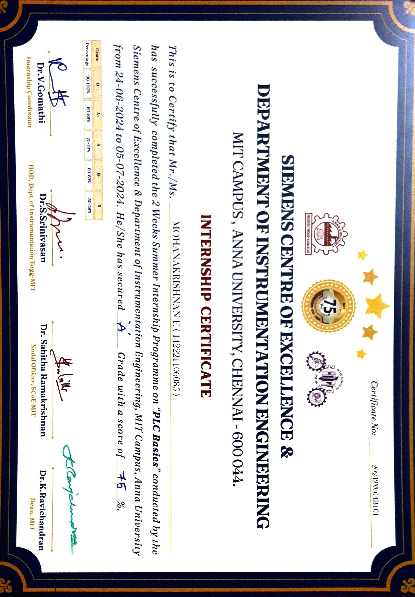

# PLC Basics - Summer Internship at Siemens Centre of Excellence

## Overview
This repository contains the projects and assignments completed during my 2-week summer internship on "PLC Basics" conducted by the Siemens Centre of Excellence and the Department of Instrumentation Engineering at MIT Campus, Anna University, Chennai. The internship took place from June 24, 2024, to July 5, 2024, and covered fundamental concepts and practical applications of Programmable Logic Controllers (PLCs).

## Internship Details
- **Institution:** Siemens Centre of Excellence & Department of Instrumentation Engineering, MIT Campus, Anna University
- **Duration:** 2 Weeks (June 24, 2024 - July 5, 2024)
- **Course Title:** PLC Basics
- **Grade:** A (75%)

## Key Learning Outcomes
During this internship, I gained practical knowledge and experience in the following areas:
- Introduction to PLCs
- PLC hardware and software components
- Basic PLC programming concepts
- Developing and testing PLC programs
- Implementing PLC-based control systems
- Troubleshooting and maintenance of PLC systems

## Projects and Assignments

### Project 1: Automatic Car Parking System
- **Objective:** Develop an automatic car parking system to optimize space utilization, enhance operational efficiency, and improve user convenience.
- **Description:** Designed and implemented a PLC-based system for managing car parking, including sensors for vehicle detection and actuators for vehicle movement.
- **Tools and Technologies Used:** CODESYS, Proximity Sensors, Ultrasonic Sensors, Infrared Sensors, Motors, Conveyor Belts, Hydraulic Systems, Pneumatic Systems, HMI (Human-Machine Interface).

## Certificate

## Conclusion
This internship has significantly enhanced my understanding of PLC systems and their applications in automation and control engineering. I am grateful to the Siemens Centre of Excellence and the Department of Instrumentation Engineering at MIT Campus, Anna University, for providing this valuable learning opportunity.

## Contact
- **Name:** Mohanakrishnan E
- **Email:** mohanakrishnan389@gmail.com
- **LinkedIn:** mohanakrishnan1729

